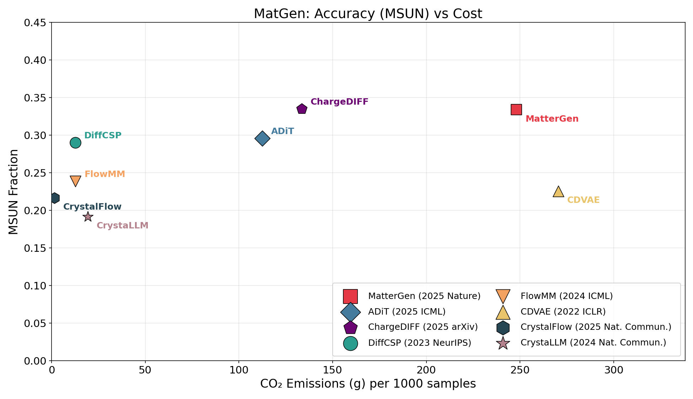
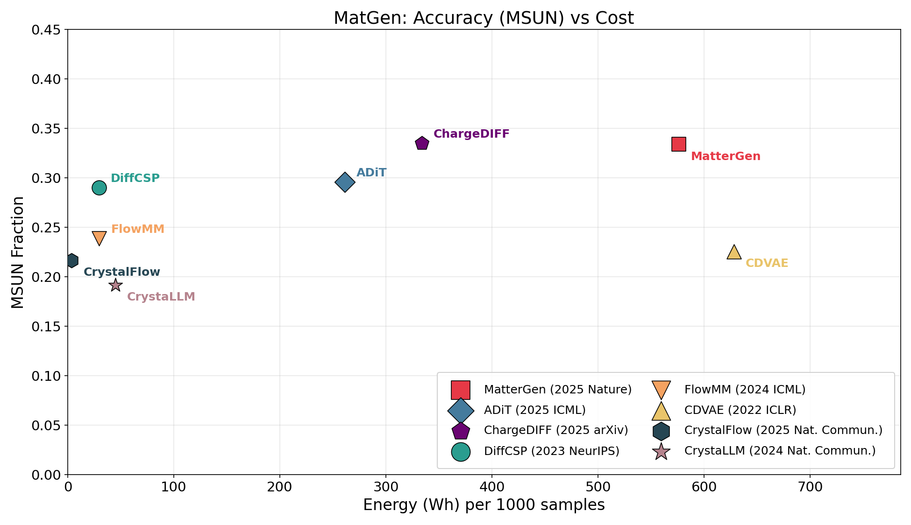
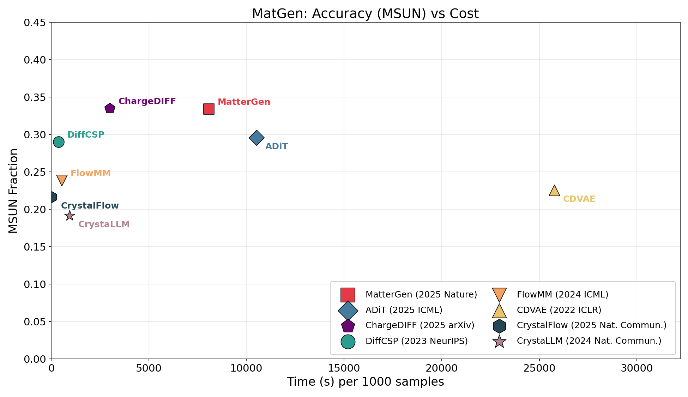
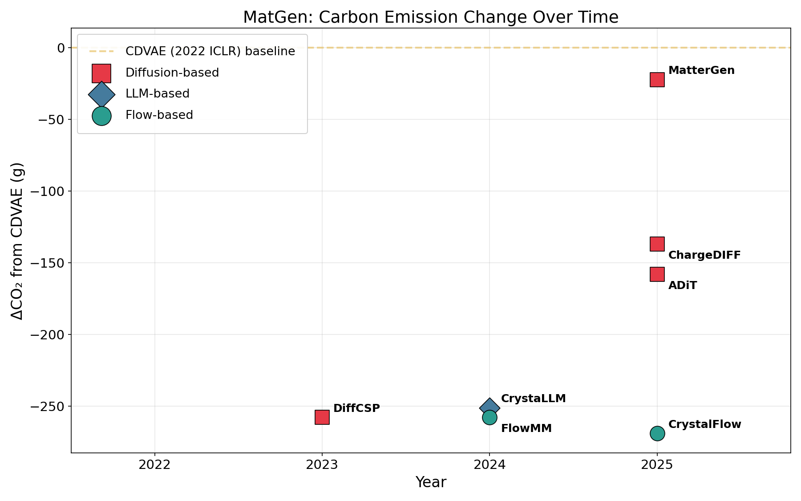
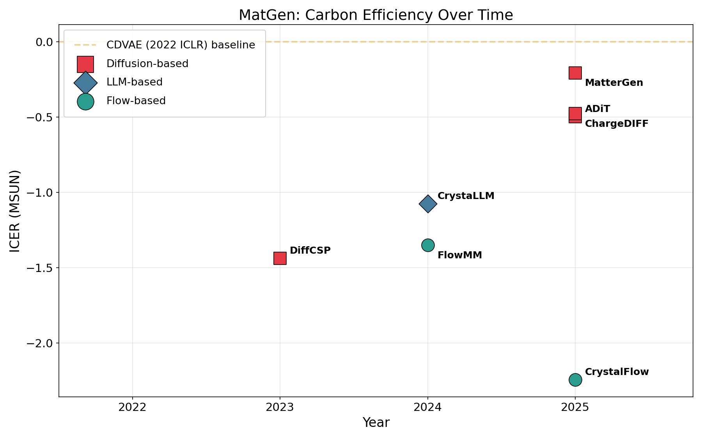

# MatGen (Material Generation)

**Task Leader:** Junkil Park

Material generation: Generate novel crystal structures and materials.

## Metrics

| Metric | Description |
|--------|-------------|
| `validity` | Fraction of valid crystal structures |
| `uniqueness` | Fraction of unique structures |
| `novelty` | Fraction of structures not seen in training data |
| `SUN` | % Stable, Unique, and Novel structures (joint metric) |
| `stability` | Fraction predicted to be thermodynamically stable |
| `coverage` | Fraction of target compositions covered |

## Test Dataset

- **MP-20**: Materials Project dataset with 45,231 experimentally observed stable inorganic materials
- Models trained and evaluated on the MP-20 train/test split

## Models

| Model | Paper | Environment | License |
|-------|-------|-------------|---------|
| CDVAE | [Crystal Diffusion Variational Autoencoder for Periodic Material Generation (ICLR 2022)](https://openreview.net/forum?id=03RLpj-tc2) | `cdvae` | MIT |
| DiffCSP | [Crystal Structure Prediction by Joint Equivariant Diffusion (NeurIPS 2023)](https://openreview.net/forum?id=oY3bBwDXGH) | `diffcsp` | MIT |
| CrystalFlow | [CrystalFlow: A Flow-Based Generative Model for Crystalline Materials (ICML 2025)](https://github.com/deepmodeling/CrystalFlow) | `crystalflow` | Apache 2.0 |
| CrystaLLM | [Crystal structure generation with autoregressive large language modeling (Nature Communications 2024)](https://www.nature.com/articles/s41467-024-54639-7) | `crystallm` | MIT |
| FlowMM | [FlowMM: Generating Materials with Riemannian Flow Matching (ICML 2024)](https://proceedings.mlr.press/v235/miller24a.html) | `flowmm` | CC BY-NC 4.0 |
| ChargeDIFF | [ChargeDiff: A Charge-aware Diffusion Model for Crystal Structure Generation (NeurIPS 2024)](https://openreview.net/forum?id=chargediff) | `chargediff` | MIT |
| MatterGen | [MatterGen: a generative model for inorganic materials design (Nature 2025)](https://www.nature.com/articles/s41586-025-08628-5) | `mattergen` | MIT |
| ADiT | [All-Atom Diffusion Transformer for Unified Crystal and Molecule Generation (ICML 2025)](https://github.com/facebookresearch/all-atom-diffusion-transformer) | `adit` | CC BY-NC 4.0 |

## Results

### Benchmark (1,000 structures)

Stability evaluated with MatterSim (meta-stable: e_hull ≤ 0.1 eV/atom). **mSUN** = meta-Stable ∩ Unique ∩ Novel count. **ICER** = CO₂ (g) / mSUN (lower is better).

| Model | Params | mSUN | Duration (s) | Energy (Wh) | CO₂ (g) | ICER (g CO₂/mSUN) |
|-------|--------|------|--------------|-------------|---------|-------------------|
| CDVAE | 4.92M | 210 | 25,764 | 628.04 | 270.41 | 1.288 |
| DiffCSP | 12.35M | 273 | 381 | 29.39 | 12.65 | 0.046 |
| CrystaLLM | 25.89M | 94 | 942 | 44.72 | 19.25 | 0.205 |
| FlowMM | 28.26M | 221 | 547 | 29.64 | 12.76 | 0.058 |
| MatterGen | ~100M | 334 | 8,079 | 576.19 | 248.09 | 0.743 |
| ADiT | ~150M | 276 | 10,512 | 261.26 | 112.49 | 0.408 |
| CrystalFlow | 20.92M | 203 | 43 | 3.70 | 1.48 | **0.007** |
| **ChargeDIFF** | — | **335** | 2,994 | 333.76 | 133.50 | 0.399 |

*Hardware: NVIDIA RTX 5000 Ada (32GB), Intel Xeon Platinum 8558 (192 cores), 503 GB RAM.*

#### Key Observations

- **ChargeDIFF** and **MatterGen** tie for highest mSUN (~335), but MatterGen costs 1.9× more CO₂.
- **CrystalFlow** achieves the best ICER (0.007 g CO₂/mSUN) — fastest generation (43 s) with minimal energy, though its mSUN (203) is moderate.
- **CDVAE** has the worst carbon efficiency (ICER 1.288): longest runtime (7+ hours) yet only 210 mSUN.
- **DiffCSP** offers the best accuracy-efficiency tradeoff among high-mSUN models (273 mSUN, ICER 0.046).
- CO₂ cost spans **180×** across models (1.48 g for CrystalFlow vs 270 g for CDVAE), while mSUN spans only 3.6×.

### mSUN vs Carbon Cost



### mSUN vs Energy



### mSUN vs Speed



### ΔCO₂ vs Year



### ICER vs Year



## Usage

```python
from MatGen.evaluate import evaluate, METRICS

# Generate structures with your model
generated_structures = model.generate(num_samples=500)

# Evaluate
results = evaluate(generated_structures, reference_structures=train_structures)
print(f"Validity: {results['validity']*100:.2f}%")
print(f"Uniqueness: {results['uniqueness']*100:.2f}%")
print(f"Stability: {results['stability']*100:.2f}%")
print(f"Coverage: {results['coverage']*100:.2f}%")
```

## Adding a New Model

See `/add-model MatGen <ModelName>` skill or `../.claude/skills/add-model.md`.
