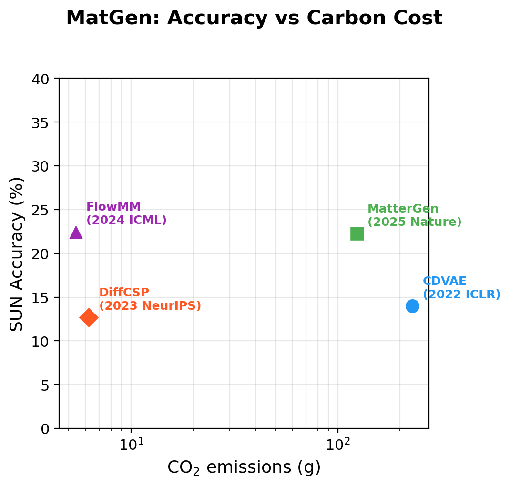
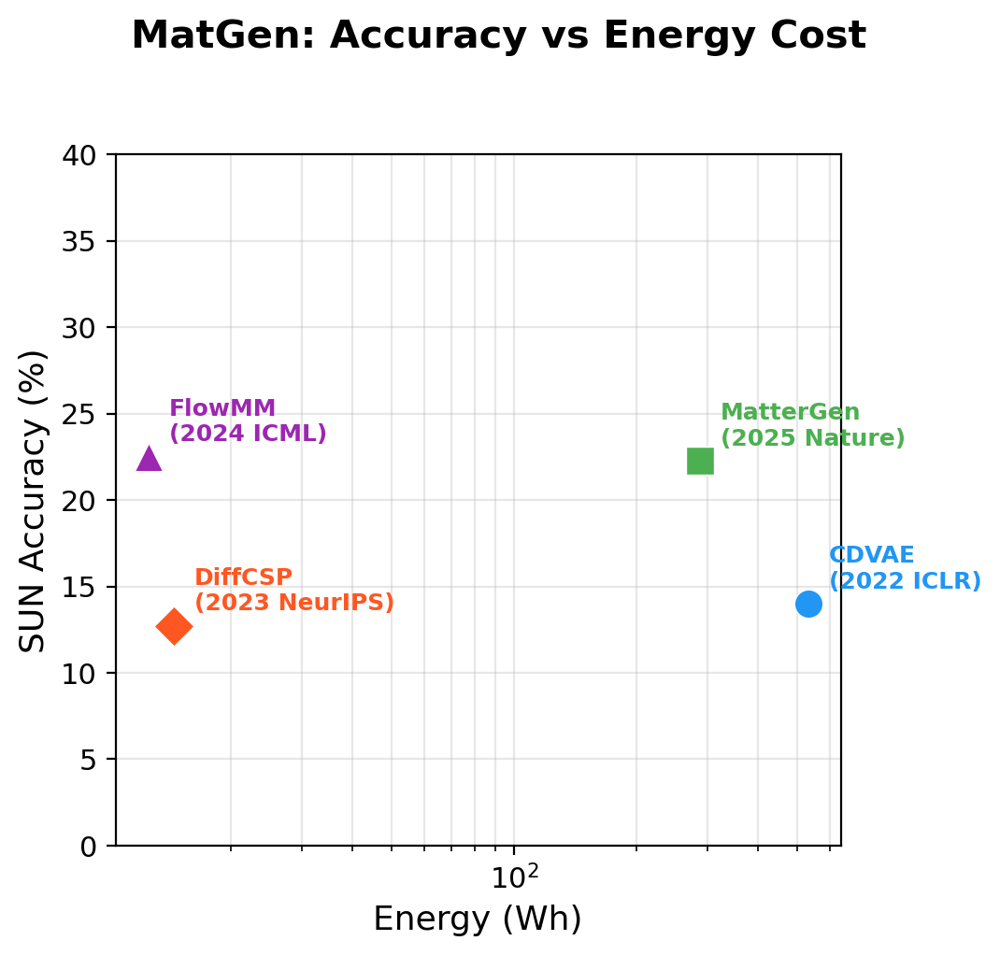
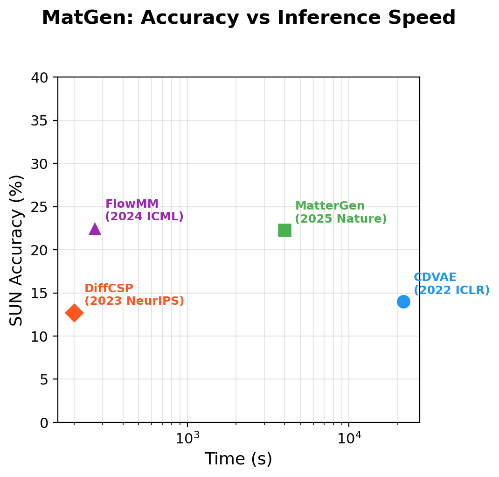

# MatGen (Material Generation)

**Task Leader:** Junkil Park

Material generation: Generate novel crystal structures and materials.

## Metrics

| Metric | Description |
|--------|-------------|
| `validity` | Fraction of valid crystal structures |
| `uniqueness` | Fraction of unique structures |
| `novelty` | Fraction of structures not seen in training data |
| `SUN` | % Stable, Unique, and Novel structures (joint metric) |
| `stability` | Fraction predicted to be thermodynamically stable |
| `coverage` | Fraction of target compositions covered |

## Test Dataset

- **MP-20**: Materials Project dataset with 45,231 experimentally observed stable inorganic materials
- Models trained and evaluated on the MP-20 train/test split

## Models

| Model | Paper | Environment | License |
|-------|-------|-------------|---------|
| CDVAE | [Crystal Diffusion Variational Autoencoder for Periodic Material Generation (ICLR 2022)](https://openreview.net/forum?id=03RLpj-tc2) | `cdvae` | MIT |
| DiffCSP | [Crystal Structure Prediction by Joint Equivariant Diffusion (NeurIPS 2023)](https://openreview.net/forum?id=oY3bBwDXGH) | `diffcsp` | MIT |
| FlowMM | [FlowMM: Generating Materials with Riemannian Flow Matching (ICML 2024)](https://proceedings.mlr.press/v235/miller24a.html) | `flowmm` | CC BY-NC 4.0 |
| MatterGen | [MatterGen: a generative model for inorganic materials design (Nature 2025)](https://www.nature.com/articles/s41586-025-08628-5) | `mattergen` | MIT |
| CrystaLLM | [Crystal structure generation with autoregressive large language modeling (Nature Communications 2024)](https://www.nature.com/articles/s41467-024-54639-7) | `crystallm` | MIT |

## Results

### Benchmark (500 structures, top_k=50)

| Model | Params | SUN (%) | Duration (s) | Energy (Wh) | CO2 (g) | Peak GPU (MB) |
|-------|--------|---------|--------------|-------------|---------|---------------|
| CDVAE | 4.92M | 13.99 | 21,616 | 530.99 | 228.63 | 493 |
| DiffCSP | 12.35M | 12.71 | 199 | 14.48 | 6.24 | 2,113 |
| FlowMM | 28.26M | 22.50 | 268 | 12.54 | 5.40 | 1,029 |
| CrystaLLM | 25.89M | — | 252 | 11.69 | 5.03 | 897 |
| MatterGen | 53.74M | 22.27 | 3,989 | 286.85 | 123.51 | 10,527 |

*Hardware: NVIDIA RTX 5000 Ada (32GB), Intel Xeon Platinum 8558 (192 cores), 503 GB RAM*

> **Note:** Accuracy metrics (validity, uniqueness, novelty) are not yet computed — evaluation module is under development. Carbon cost numbers reflect generation of 500 structures per model.

### SUN Accuracy vs Carbon Cost



### SUN Accuracy vs Energy



### SUN Accuracy vs Speed



## Usage

```python
from MatGen.evaluate import evaluate, METRICS

# Generate structures with your model
generated_structures = model.generate(num_samples=500)

# Evaluate
results = evaluate(generated_structures, reference_structures=train_structures)
print(f"Validity: {results['validity']*100:.2f}%")
print(f"Uniqueness: {results['uniqueness']*100:.2f}%")
print(f"Stability: {results['stability']*100:.2f}%")
print(f"Coverage: {results['coverage']*100:.2f}%")
```

## Adding a New Model

See `/add-model MatGen <ModelName>` skill or `../.claude/skills/add-model.md`.
