# MolGen (Molecule Generation)

**Task Leader:** Gunwook Nam

Molecular generation: Generate novel molecules from distribution.

## Metrics

| Metric | Description |
|--------|-------------|
| `V·U·N` | Validity × Uniqueness × Novelty (higher is better) |
| `S.U.N` | SA_norm × Uniqueness × Novelty (higher is better) |
| `FCD` | Fréchet ChemNet Distance between generated and train distributions (lower is better) |

- `validity`: Fraction of valid SMILES strings
- `uniqueness`: Fraction of unique molecules among valid ones
- `uniqueness_total`: Fraction of unique molecules among **all** generated (total denominator)
- `novelty`: Fraction of novel molecules among unique valid ones
- `novelty_total`: Fraction of novel molecules among **all** generated (total denominator)
- `vuns`: V × U_total × N_total × SA_norm (composite score, total denominator)
- `sa_score_norm`: Normalized SA Score, (10 − SAScore) / 9, averaged over valid molecules (0=hard, 1=easy)
- `sa_score_filter`: Fraction of valid molecules with SA Score < 4 (synthesizable)

## Training Dataset

All models are trained on [ChEMBL 28](https://ftp.ebi.ac.uk/pub/databases/chembl/ChEMBLdb/releases/chembl_28/) (1.19M molecules, filtered).

- Location: `data/chembl28/{train,val,test}.txt`
- Split: 80/10/10, seed=42
- Filters: allowed atoms {C, N, O, S, F, Cl, Br}, MW ≤ 500, heavy atoms 3–50

## Models

| Model | Year | Venue | Params | Environment |
|-------|------|-------|--------|-------------|
| REINVENT | 2017 | J. Cheminf. | 4.4M | `carbon-reinvent` |
| JT-VAE | 2018 | ICML | 7.1M | `carbon-jtvae` |
| HierVAE | 2020 | ICML | 8.0M | `carbon-jtvae` |
| MolGPT | 2021 | J. Chem. Inf. Model. | 6.4M | `carbon-reinvent` |
| DiGress | 2023 | ICML | 16.2M | `carbon-digress` |
| REINVENT4 | 2024 | J. Cheminf. | 5.8M | `carbon-reinvent` |
| SmileyLlama | 2024 | arXiv | 8.0B | `carbon-smileyLlama` |
| DeFoG | 2024 | NeurIPS | 16.3M | `carbon-defog` |

## Results

### Pre-trained Benchmark (10,000 molecules)

Models evaluated using their original pre-trained checkpoints and training datasets.

#### Valid Denominator (U = unique/valid, N = novel/unique)

| Model | Validity | Uniqueness | Novelty | SA_norm | V·U·N (%) | S.U.N (%) | VUNS (%) | CO₂ (g) | Energy (Wh) |
|-------|----------|------------|---------|---------|-----------|-----------|----------|---------|-------------|
| REINVENT | 0.9438 | 0.9997 | 0.9316 | 0.7988 | 87.90 | 74.40 | 70.22 | 0.18 | 0.41 |
| JT-VAE | 1.0000 | 0.9991 | 0.9147 | 0.8283 | 91.39 | 75.70 | 75.70 | 10.58 | 24.58 |
| HierVAE | 0.9853 | 0.9944 | 0.9400 | 0.8343 | 92.10 | 77.98 | **76.84** | 11.97 | 27.81 |
| MolGPT | 0.9937 | 0.9991 | 0.7771 | 0.8372 | 77.15 | 65.00 | 64.59 | 1.07 | 2.49 |
| DiGress | 0.8759 | 0.9995 | 0.9417 | 0.8362 | 82.45 | **78.71** | 68.94 | 175.35 | 407.26 |
| **REINVENT4** | **0.9806** | **0.9999** | **0.9603** | 0.7878 | **94.16** | 75.65 | 74.18 | **0.07** | **0.17** |
| SmileyLlama | 0.9456 | 1.0000 | 0.9968 | 0.7800 | 94.26 | 77.75 | 73.52 | 21.79 | 54.47 |
| DeFoG | 0.9155 | 0.9996 | 0.8990 | **0.8446** | 82.27 | 75.90 | 69.49 | 355.24 | 888.09 |

| V·U·N vs Carbon | V·U·N vs Energy | V·U·N vs Speed |
|:----------------:|:---------------:|:--------------:|
|  | 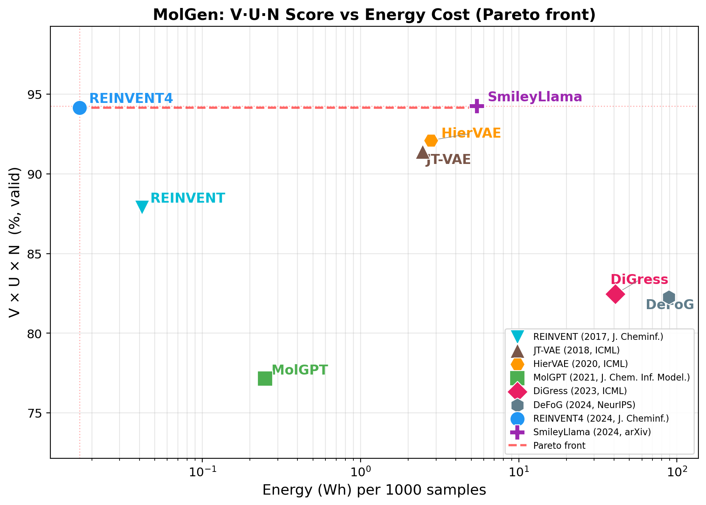 | 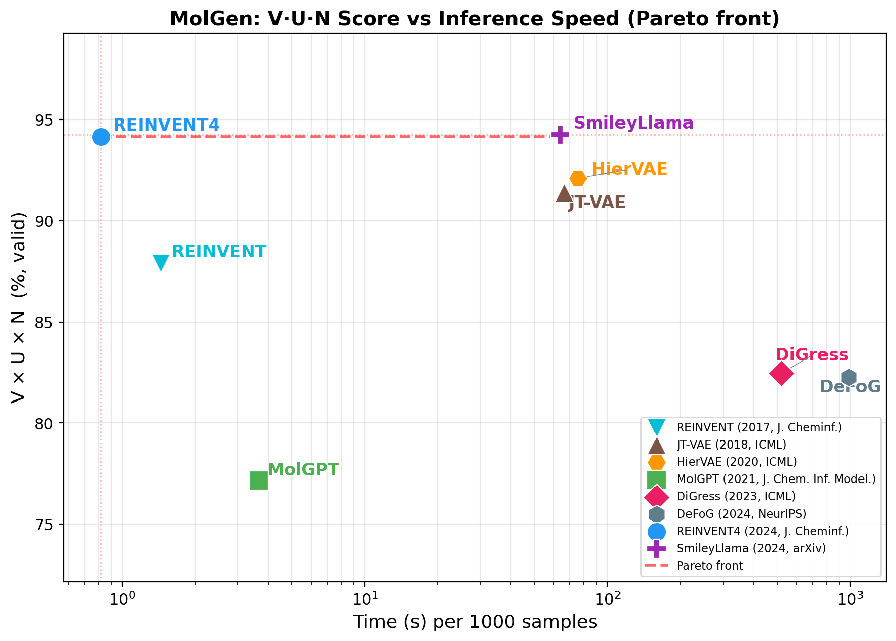 |

| S.U.N vs Carbon | S.U.N vs Energy | S.U.N vs Speed |
|:----------------:|:---------------:|:--------------:|
|  |  |  |

| VUNS vs Carbon | VUNS vs Energy | VUNS vs Speed |
|:--------------:|:--------------:|:-------------:|
| 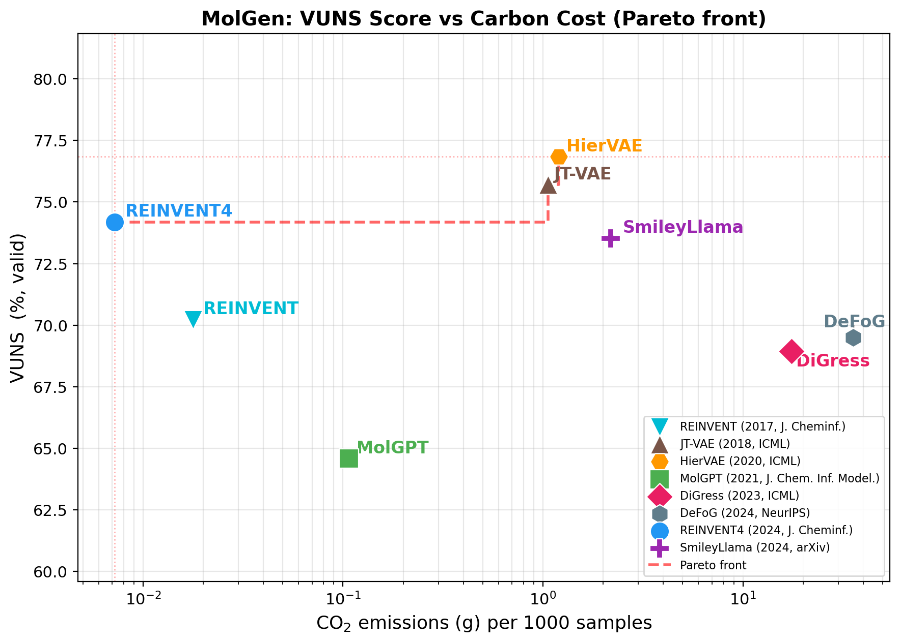 | 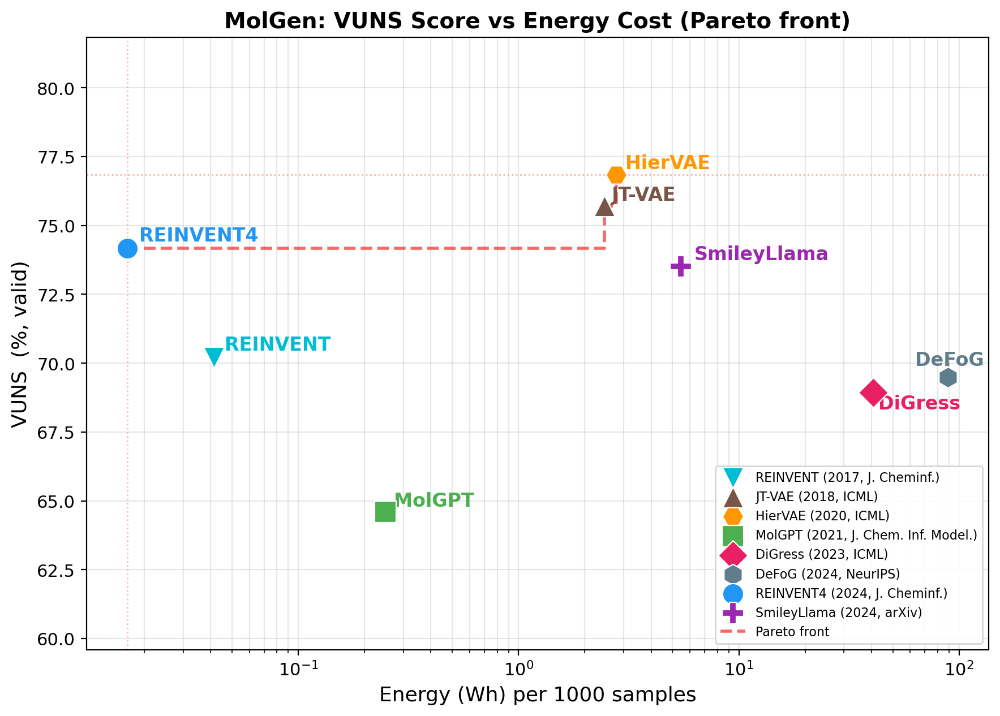 | 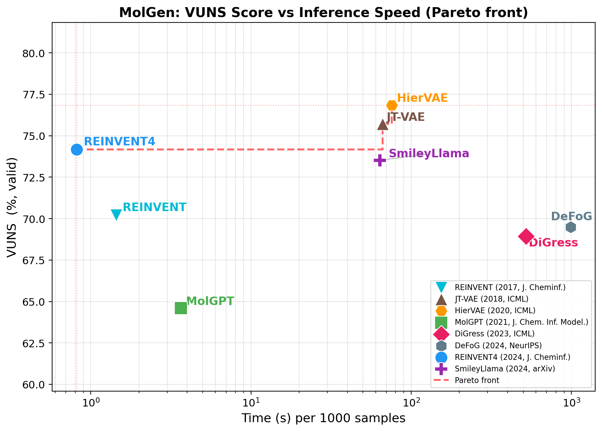 |

#### Total Denominator (U = unique/total, N = novel/total)

Uniqueness and Novelty computed over **all generated molecules** (not just valid ones). Models with low validity are penalized more heavily.

| Model | Validity | U (total) | N (total) | SA_norm | V·U·N (%) | VUNS (%) | CO₂ (g) | Energy (Wh) |
|-------|----------|-----------|-----------|---------|-----------|----------|---------|-------------|
| REINVENT | 0.9438 | 0.9435 | 0.9435 | 0.7988 | 84.02 | 67.11 | 0.18 | 0.41 |
| JT-VAE | 1.0000 | 0.9991 | 0.9139 | 0.8283 | 91.31 | 75.63 | 10.58 | 24.58 |
| HierVAE | 0.9853 | 0.9798 | 0.9210 | 0.8343 | 88.91 | 74.18 | 11.97 | 27.81 |
| **MolGPT** | 0.9937 | 0.9928 | 0.9928 | 0.8372 | **97.94** | **82.00** | 1.07 | 2.49 |
| DiGress | 0.8759 | 0.8755 | 0.8755 | 0.8362 | 67.14 | 56.14 | 175.35 | 407.26 |
| **REINVENT4** | **0.9806** | **0.9805** | **0.9805** | 0.7878 | 94.27 | 74.27 | **0.07** | **0.17** |
| SmileyLlama | 0.9456 | 0.9456 | 0.9456 | 0.7800 | 84.55 | 65.95 | 21.79 | 54.47 |
| DeFoG | 0.9155 | 0.9151 | 0.9151 | **0.8446** | 76.66 | 64.75 | 355.24 | 888.09 |

| V·U·N vs Carbon | V·U·N vs Energy | V·U·N vs Speed |
|:----------------:|:---------------:|:--------------:|
| 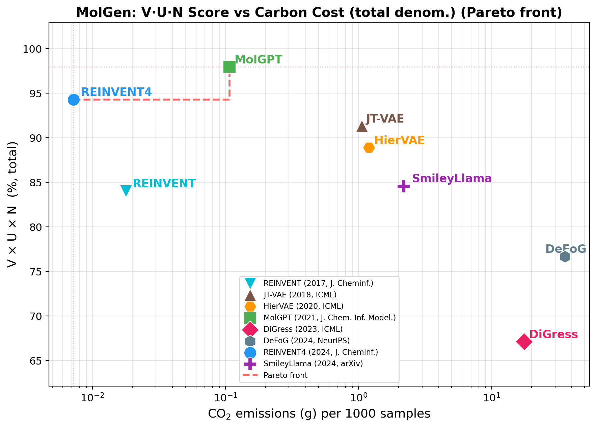 | 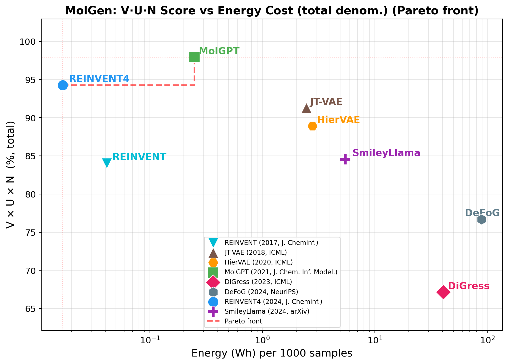 | 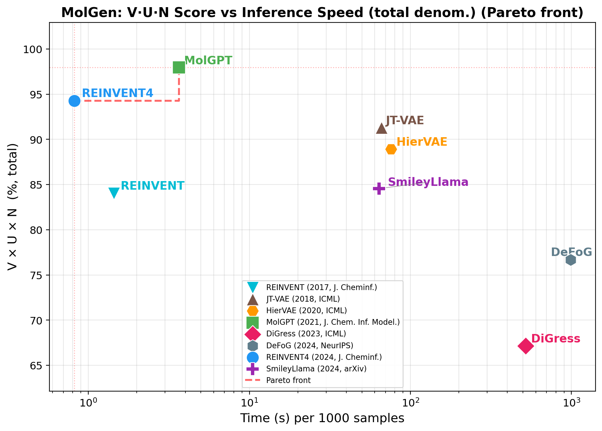 |

| VUNS vs Carbon | VUNS vs Energy | VUNS vs Speed |
|:--------------:|:--------------:|:-------------:|
| 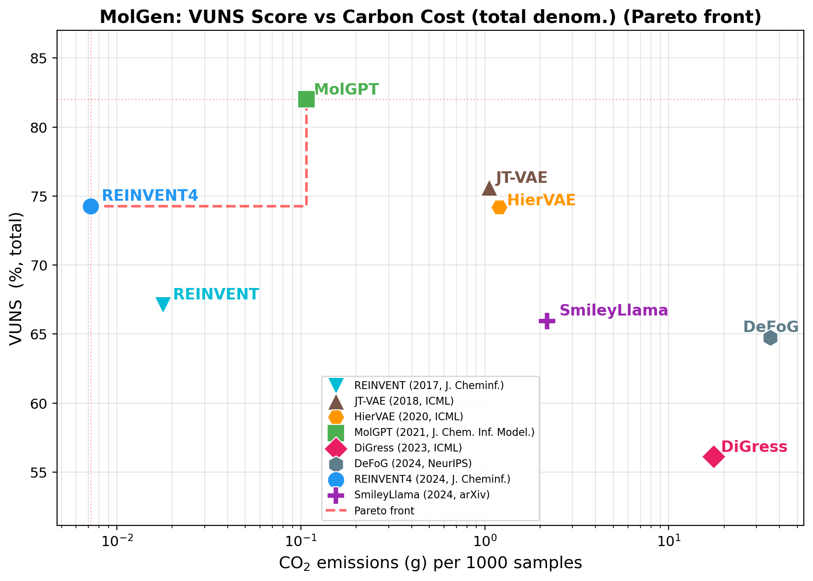 | 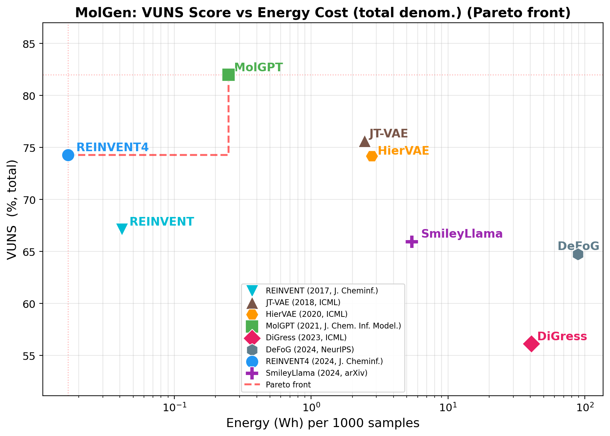 | 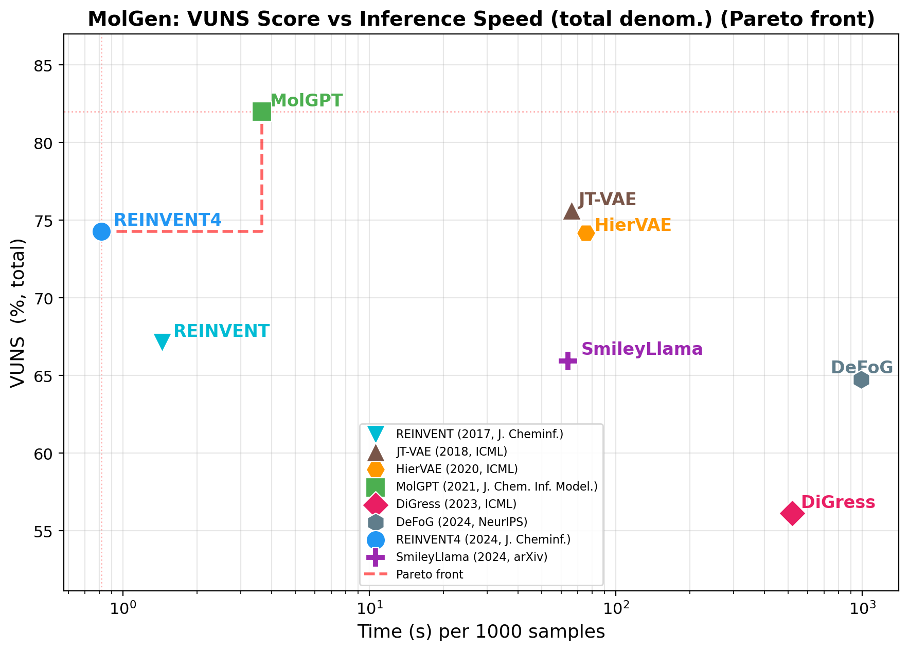 |

#### Carbon Efficiency Over Time

| ΔCO₂ vs Year (full scale) |
|:--------------------------:|
|  |

