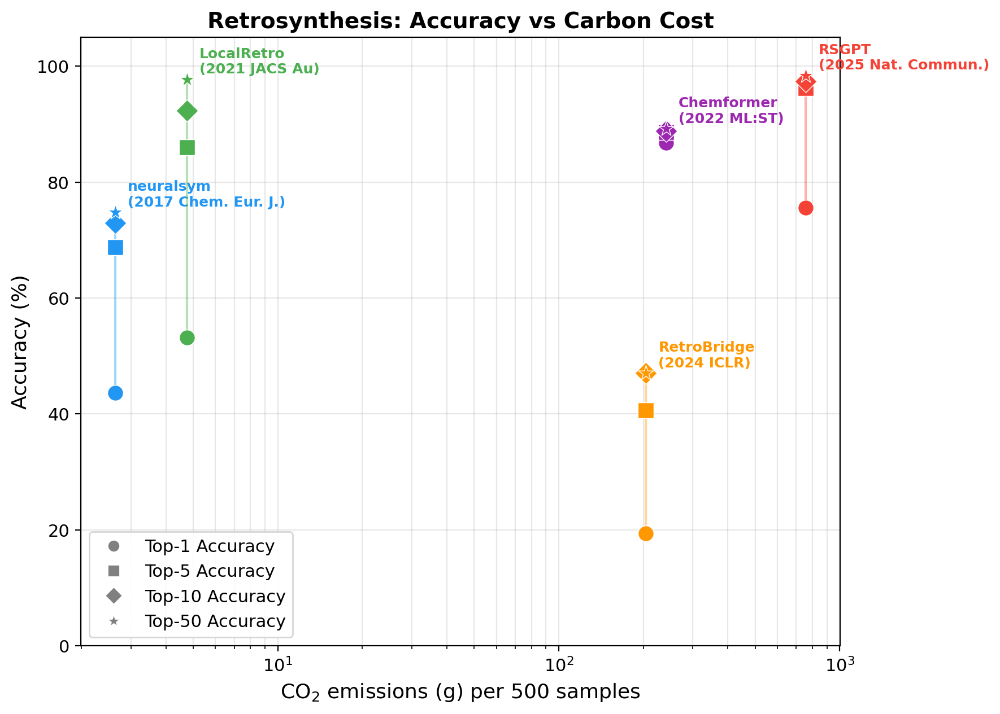

# The Carbon Cost of Generative AI for Science

[](https://arxiv.org/)
[](LICENSE)

A benchmarking framework for evaluating the **carbon efficiency** of generative AI models in scientific discovery.

## Abstract

Artificial intelligence is accelerating scientific discovery, yet current evaluation practices focus almost exclusively on accuracy, neglecting the computational and environmental costs of increasingly complex generative models. This oversight obscures a critical trade-off: **state-of-the-art performance often comes at disproportionate expense**, with order-of-magnitude increases in carbon emissions yielding only marginal improvements.

We present **The Carbon Cost of Generative AI for Science**, a benchmarking framework that systematically evaluates the carbon efficiency of generative models—including diffusion models and large language models—for scientific discovery. Spanning four core tasks (**retrosynthesis**, **molecule generation**, **material generation**, and **machine learning interatomic potentials**), we assess open-source models using standardized protocols that jointly measure predictive performance and carbon footprint.

**Key Finding**: Simpler, specialized models frequently match or approach state-of-the-art accuracy while consuming **10-100x less compute**.

## Tasks

| Task | Directory | Leader | Status |
|------|-----------|--------|--------|
| Retrosynthesis | `Retro/` | Shuan Chen | Complete |
| Molecule Generation | `MolGen/` | Gunwook Nam | Planned |
| Material Generation | `MatGen/` | Junkil Park | Planned |
| ML Interatomic Potentials | `MLIP/` | Junyoung Choi | Planned |

---

## Benchmarking Methodology

All tasks follow the same standardized protocol to ensure fair, reproducible comparisons:

1. **Same dataset, same metrics, same hardware** — Every model in a task runs on the same test set, is evaluated with the same metrics, and uses the same GPU hardware (reported in results JSON).
2. **Uniform `Inference.py` interface** — Every model exposes a `run()` function with a standardized return format so the benchmark runner can orchestrate any model identically.
3. **Carbon tracking via CodeCarbon** — Energy consumption (Wh), CO2 emissions (g), and wall-clock time are recorded automatically using our `CarbonTracker` wrapper around [CodeCarbon](https://codecarbon.io/).
4. **Environment isolation** — Each model has its own conda environment to prevent dependency conflicts. The runner script (`run.sh`) activates the correct environment automatically.
5. **Normalized comparison** — Cost metrics are normalized to a fixed sample count (e.g., per 500 samples) so models evaluated on different subset sizes can be compared fairly.
6. **Structured JSON results** — Every benchmark run produces a JSON file with accuracy, carbon, hardware, and metadata fields, enabling automated analysis and plotting.
7. **Accuracy vs Cost visualization** — Results are plotted as accuracy (y-axis) vs cost metric (x-axis, log-scale) to reveal the efficiency frontier across models.

---

## Retrosynthesis Results

Five models benchmarked on 1,000 samples from the USPTO-50K test set, evaluated on top-k exact-match accuracy with full carbon tracking.

**Hardware:** NVIDIA RTX 5000 Ada Generation, Intel Xeon Platinum 8558, 503 GB RAM



| Model | Params | Top-1 | Top-10 | Top-50 | Duration (s) | Energy (Wh) | CO2 (g) | Peak GPU (MB) |
|-------|--------|-------|--------|--------|--------------|-------------|---------|---------------|
| neuralsym | 32.5M | 43.0% | 72.4% | 74.0% | 192 | 21.2 | 8.5 | 504 |
| LocalRetro | 8.6M | 52.5% | 92.3% | 97.7% | 402 | 41.3 | 16.5 | 154 |
| Chemformer | 44.7M | 88.0% | 90.8% | 91.2% | 16,911 | 1,378 | 551 | 207 |
| RetroBridge | 4.6M | 22.1% | 44.5% | 51.7% | 61,974 | 4,566 | 1,966 | 479 |
| RSGPT | ~1.6B | 77.5% | 97.8% | 98.7% | 49,782 | 3,787 | 1,515 | 6,950 |

**Key insight:** LocalRetro achieves 52.5% top-1 accuracy (97.7% top-50) using only 8.5 g CO2 and 154 MB GPU memory — **65x less carbon** than RSGPT and **45x less** than the most expensive model (RetroBridge), while delivering competitive top-k coverage. Chemformer leads on top-1 accuracy (88.0%) but at 65x the carbon cost of LocalRetro. The largest model (RSGPT, ~1.6B params) achieves the best top-50 accuracy (98.7%) but consumes **178x more carbon** than LocalRetro for only a 1 percentage point improvement.

---

## Guide for Task Leaders

Each task leader is responsible for benchmarking models in their domain. **Use Claude Code** to accelerate the process. The workflow is the same for every task:

### Step 1: Set Up Your Task Directory

Your task directory should follow this structure:

```
<Task>/
├── README.md           # Task description, metrics, models, results table
├── evaluate.py         # Evaluation module (metrics + test data loading)
├── data/               # Test datasets
├── <Model1>/
│   ├── Inference.py    # Uniform interface (must implement run())
│   ├── environment.yml # Conda environment
│   ├── CLAUDE.md       # Model-specific guidance for Claude Code
│   └── models/         # Checkpoints (gitignored)
├── <Model2>/
│   └── ...
└── ...
```

See `Retro/` for a complete reference implementation.

### Step 2: Implement the Evaluation Module

Create `<Task>/evaluate.py` with:

```python
METRICS = ["metric_1", "metric_2", ...]  # Available metrics

def load_test_data(data_path=None, limit=None):
    """Load test dataset. Returns list of dicts."""
    ...

def evaluate(predictions, test_cases, metrics=None):
    """Compute metrics. Returns dict of metric_name -> score."""
    ...
```

### Step 3: Add Models with Uniform Interface

Each model must implement `Inference.py` with a `run()` function:

```python
def run(input_data, top_k=10) -> List[Dict]:
    """
    Returns:
        [{'input': '...', 'predictions': [{'smiles': '...', 'score': 0.95}, ...]}]
    """
```

Each model needs its own conda environment (`environment.yml`) to avoid dependency conflicts.

### Step 4: Register in the Benchmark Runner

Update these files to include your task and models:

1. `benchmarks/run_benchmark.py` - Add task and model mappings
2. `benchmarks/run.sh` - Add conda environment mappings
3. `benchmarks/setup_envs.sh` - Add environment setup functions
4. `benchmarks/configs/models.yaml` - Add model configurations

### Step 5: Run Benchmarks with Carbon Tracking

```bash
# Run a single model
./benchmarks/run.sh --model <ModelName> --limit 1000 --track_carbon

# Run all models for your task
./benchmarks/run.sh --model all --limit 1000 --track_carbon
```

### Step 6: Generate Plots and Report Results

Generate accuracy vs cost plots from your benchmark results:

```bash
# Generate all plots (carbon, energy, speed) — combined view
python benchmarks/plot_results.py --task <Task> --combined

# Generate plots for a specific sample count
python benchmarks/plot_results.py --task <Task> --combined --samples 500

# Single x-axis metric
python benchmarks/plot_results.py --task <Task> --combined --xaxis emissions_g_co2

# Or use the Claude Code skill
# /plot <Task>
```

Plots are saved to `benchmarks/figures/<Task>/`. Then update your task's `README.md` with the results table:

```markdown
| Model | Params | Metric-1 | Metric-2 | Duration (s) | Energy (Wh) | CO2 (g) | Peak GPU (MB) |
```

---

## Getting Started

### Prerequisites

- Linux with NVIDIA GPU(s)
- Conda (Miniconda or Anaconda)
- Git

### Clone and Setup

```bash
git clone https://github.com/shuan4638/Carbon4Science.git
cd Carbon4Science

# Setup environments for a specific task
cd benchmarks
./setup_envs.sh            # All retrosynthesis models
./setup_envs.sh neuralsym  # Single model
```

### Run a Benchmark

```bash
cd benchmarks

# Single model with carbon tracking
./run.sh --model neuralsym --limit 100 --track_carbon

# All models
./run.sh --model all --limit 1000 --track_carbon --output results/benchmark.json
```

---

## Repository Structure

```
Carbon4Science/
├── README.md                 # This file
├── CLAUDE.md                 # Instructions for Claude Code
├── .claude/skills/           # Claude Code skills (add-model, benchmark, evaluate)
│
├── benchmarks/               # Shared benchmark infrastructure
│   ├── run.sh               # Unified runner (handles conda envs)
│   ├── run_benchmark.py     # Python benchmark runner
│   ├── carbon_tracker.py    # Carbon/energy measurement
│   ├── setup_envs.sh        # Environment setup
│   ├── configs/             # Model configs, hardware specs
│   └── results/             # Benchmark outputs (JSON)
│
├── Retro/                   # Retrosynthesis task (Shuan Chen)
│   ├── neuralsym/           # Template-based, Nature 2018
│   ├── LocalRetro/          # MPNN + attention, JACS Au 2021
│   ├── RetroBridge/         # Markov bridges, ICLR 2024
│   ├── Chemformer/          # BART transformer, ML:ST 2022
│   └── RSGPT/               # GPT 1.6B params, Nat. Comm. 2025
│
├── MolGen/                  # Molecule generation (Gunwook Nam)
├── MatGen/                  # Material generation (Junkil Park)
└── MLIP/                    # ML interatomic potentials (Junyoung Choi)
```

---

## Using Claude Code

This repository is designed to work with [Claude Code](https://claude.ai/code). Each task directory includes a `CLAUDE.md` file with model-specific instructions. Claude Code skills are available:

- `/add-model <Task> <ModelName>` - Step-by-step guide to add a new model
- `/benchmark <ModelName>` - Run a carbon-tracked benchmark
- `/evaluate <Task>` - Run evaluation on predictions
- `/plot <Task>` - Generate accuracy vs cost plots from benchmark results

To get started with Claude Code on your task:

```bash
cd Carbon4Science
claude  # Launch Claude Code
```

Then tell Claude what you want to do, e.g.:
- "Add a new model called DiffSBDD to MolGen"
- "Run benchmark for all MatGen models with 1000 samples"
- "Set up the MLIP evaluation pipeline"

---

## Citation

```bibtex
@article{carbon2025,
  title={The Carbon Cost of Generative AI for Science},
  author={...},
  journal={...},
  year={2026}
}
```

## License

MIT License - see [LICENSE](LICENSE) for details.
