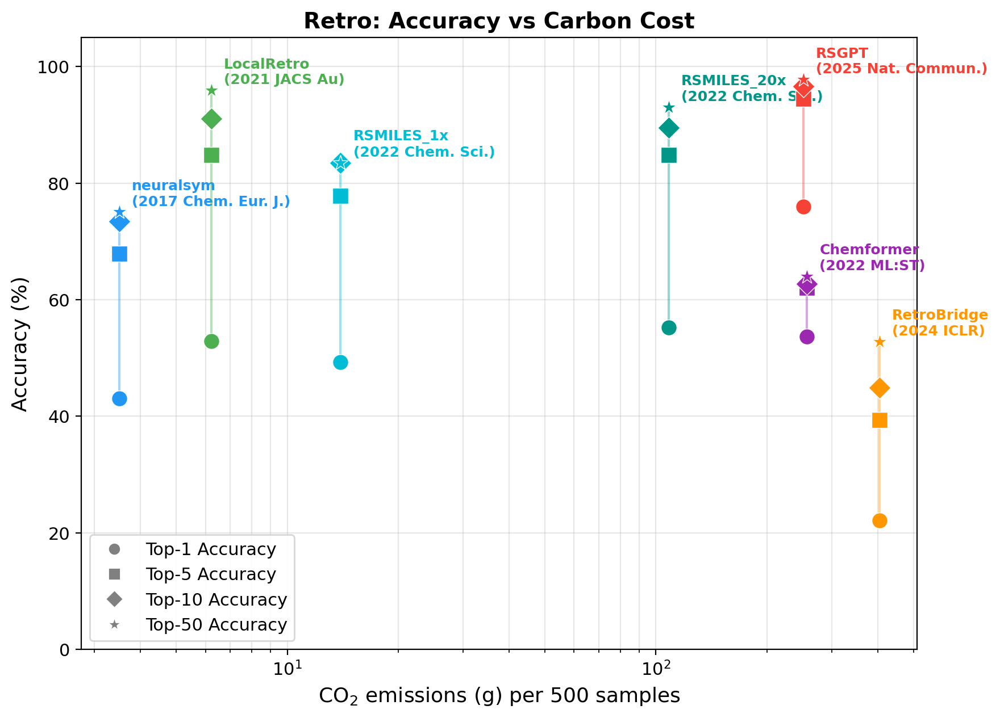

# The Carbon Cost of Generative AI for Science

[](https://arxiv.org/)
[](LICENSE)

A benchmarking framework for evaluating the **carbon efficiency** of generative AI models in scientific discovery.

## Abstract

Artificial intelligence is accelerating scientific discovery, yet current evaluation practices focus almost exclusively on accuracy, neglecting the computational and environmental costs of increasingly complex generative models. This oversight obscures a critical trade-off: **state-of-the-art performance often comes at disproportionate expense**, with order-of-magnitude increases in carbon emissions yielding only marginal improvements.

We present **The Carbon Cost of Generative AI for Science**, a benchmarking framework that systematically evaluates the carbon efficiency of generative models—including diffusion models and large language models—for scientific discovery. Spanning four core tasks (**retrosynthesis**, **molecule generation**, **material generation**, and **machine learning interatomic potentials**), we assess open-source models using standardized protocols that jointly measure predictive performance and carbon footprint.

**Key Finding**: Simpler, specialized models frequently match or approach state-of-the-art accuracy while consuming **10-100x less compute**.

## Tasks

| Task | Directory | Leader | Status |
|------|-----------|--------|--------|
| Retrosynthesis | `Retro/` | Shuan Chen | Complete |
| Molecule Generation | `MolGen/` | Gunwook Nam | Planned |
| Material Generation | `MatGen/` | Junkil Park | Planned |
| ML Interatomic Potentials | `MLIP/` | Junyoung Choi | Planned |

---

## Benchmarking Methodology

All tasks follow the same standardized protocol to ensure fair, reproducible comparisons:

1. **Same dataset, same metrics, same hardware** — Every model in a task runs on the same test set, is evaluated with the same metrics, and uses the same GPU hardware (reported in results JSON).
2. **Uniform `Inference.py` interface** — Every model exposes a `run()` function with a standardized return format so the benchmark runner can orchestrate any model identically.
3. **Carbon tracking via CodeCarbon** — Energy consumption (Wh), CO2 emissions (g), and wall-clock time are recorded automatically using our `CarbonTracker` wrapper around [CodeCarbon](https://codecarbon.io/).
4. **Environment isolation** — Each model has its own conda environment to prevent dependency conflicts. The runner script (`run.sh`) activates the correct environment automatically.
5. **Normalized comparison** — Cost metrics are normalized to a fixed sample count (e.g., per 500 samples) so models evaluated on different subset sizes can be compared fairly.
6. **Structured JSON results** — Every benchmark run produces a JSON file with accuracy, carbon, hardware, and metadata fields, enabling automated analysis and plotting.
7. **Accuracy vs Cost visualization** — Results are plotted as accuracy (y-axis) vs cost metric (x-axis, log-scale) to reveal the efficiency frontier across models.

---

## Retrosynthesis Results

Seven models benchmarked on the full USPTO-50K test set (~5,000 samples), evaluated on top-k exact-match accuracy with full carbon tracking. Costs are averaged per 500 samples for fair comparison.

**Hardware:** NVIDIA RTX 5000 Ada Generation, Intel Xeon Platinum 8558, 503 GB RAM



| Model | Params | Top-1 | Top-5 | Top-10 | Top-50 | Time/500 (s) | Energy/500 (Wh) | CO2/500 (g) | Peak GPU (MB) |
|-------|--------|-------|-------|--------|--------|-------------|----------------|------------|---------------|
| neuralsym | 32.5M | 43.0% | 67.7% | 72.8% | 74.8% | 128 | 7.5 | 3.5 | 504 |
| LocalRetro | 8.6M | 52.8% | 85.0% | 91.5% | 95.6% | 231 | 16.8 | 6.2 | 154 |
| RSMILES_1x | ~30M | 49.3% | 77.8% | 83.5% | 83.5% | 319 | 34.9 | 14.0 | 121 |
| RSMILES_20x | ~30M | 55.3% | 84.8% | 89.6% | 93.0% | 4,404 | 270.6 | 108.2 | 924 |
| Chemformer | 44.7M | 53.6% | 62.0% | 62.8% | 64.0% | 8,492 | 641.9 | 256.7 | 209 |
| RSGPT | ~1.6B | 76.0% | 94.5% | 96.6% | 97.8% | 7,892 | 627.0 | 250.8 | 6,950 |
| RetroBridge | 4.6M | 22.1% | 39.4% | 44.9% | 52.8% | 15,749 | 937.2 | 403.5 | 601 |

**Key insights:**
- **LocalRetro** achieves 52.8% top-1 accuracy at only **6.2 g CO2 per 500 samples** — the most carbon-efficient model with competitive accuracy.
- **RSGPT** (1.6B params) leads on top-1 accuracy (76.0%) but at **40x the carbon cost** of LocalRetro.
- **RSMILES 1x vs 20x** demonstrates the test-time augmentation tradeoff: 20x augmentation improves top-1 by +6% but costs **7.7x more carbon** — a clear accuracy-vs-efficiency frontier.
- **Chemformer** achieves similar top-1 to LocalRetro (53.6% vs 52.8%) but at **41x the carbon cost**, highlighting that larger models don't always pay off.
- **RetroBridge** (diffusion-based) is both the slowest and lowest accuracy — consuming **403.5 g CO2 per 500 samples** for only 22.1% top-1 accuracy.

---

## For Task Leaders

Each task leader is responsible for benchmarking models in their domain.
Claude Code is the recommended way to do this — it reads the project's
`CLAUDE.md` files automatically and understands the benchmarking protocol,
directory structure, and conventions.

### Prerequisites

- Linux with NVIDIA GPU(s)
- Conda (Miniconda or Anaconda)
- Git
- [Claude Code](https://docs.anthropic.com/en/docs/claude-code)
  (`npm install -g @anthropic-ai/claude-code`)

### Git Workflow

**Never commit directly to `main`.** Always use feature branches and pull requests.

```
  main (shared timeline)        Your branch (private workspace)
  ─────────────────────         ────────────────────────────────

       ● Retro complete
       │
       │  ① PULL ─ get the latest version
       │          "git pull origin main"
       │
       ●─ ─ ─ ─ ─ ─ ─ ─ ─ ─ ─ ─┐
       │                         │  ② BRANCH ─ create your own copy
       │                         │  "git checkout -b gunwook/molgen"
       │                         │
       │                         ● Add evaluate.py
       │                         │
       │                         ● Add VAE model
       │                         │
       │                         ● Run benchmarks
       │                         │
       │                         │  ③ PUSH ─ upload your branch to GitHub
       │                         │  "git push -u origin gunwook/molgen"
       │                         │
       │  ④ PULL REQUEST         │
       │     "Please review  ◄───┘  "gh pr create ..."
       │      and merge my
       │      changes"
       │
       ●◄─ ─ ─ ─ ─ ─ ─ ─ ─ ─ ─ ─   ⑤ MERGE ─ your work joins main
       │  (MolGen added!)
       │
       │  ⑥ PULL again before next task
       │
       ●─ ─ ─ ─ ─ ─ ─ ─ ─ ─ ┐
       │                      │  New branch: junkil/matgen-cdvae
       │                      ● ...
       ▼                      ▼
```

**Key concepts:**
- **Pull** = download the latest changes from `main` to stay up to date
- **Branch** = a private copy where you work without affecting others
- **Push** = upload your branch to GitHub so others can see it
- **Pull Request (PR)** = ask the team to review and merge your branch into `main` (requires push first)
- **Merge** = your branch's changes are added to `main` for everyone

**Commands:**

```bash
# 1. Clone the repo (first time only)
git clone https://github.com/shuan4638/Carbon4Science.git
cd Carbon4Science

# 2. Pull latest main and create your branch
git checkout main
git pull origin main
git checkout -b <your-name>/<description>
# e.g., git checkout -b gunwook/molgen-setup

# 3. Do your work (add models, run benchmarks, update READMEs)
claude   # Claude Code guides you through the process

# 4. Commit and push
git add <files>
git commit -m "Add VAE model to MolGen benchmarks"
git push -u origin <your-branch-name>

# 5. Create a pull request
gh pr create --title "Add VAE to MolGen" --body "..."

# 6. Before starting new work, always pull latest main
git checkout main
git pull origin main
git checkout -b <your-name>/<next-task>
```

### Quick Start

```bash
git clone https://github.com/shuan4638/Carbon4Science.git
cd Carbon4Science
git checkout -b <your-name>/<task>-setup
claude
```

Introduce yourself in the first message:

> I'm [name], the task leader for [task]. I need to set up the [task]
> benchmarking pipeline from scratch. Guide me through the process
> step by step.

Claude will walk you through the full workflow, using `Retro/` as the
reference implementation.

### What You'll Build

Claude Code will guide you through each of these steps:

1. **Task directory** — `<Task>/` with README, evaluate.py, data/, model subdirectories, and `results/{outputs,figures}/`
2. **Benchmark scripts** — `<Task>/benchmarks/` copied from `Retro/benchmarks/` and adapted for your models
3. **Evaluation module** — `<Task>/evaluate.py` with your task's metrics and test data loader
4. **Models** — `<Task>/<Model>/Inference.py` with the uniform `run()` interface, conda environment, and CLAUDE.md for each model
5. **Benchmark runs** — All models run with carbon tracking on the same test set and hardware
6. **Results** — JSON outputs in `<Task>/results/outputs/`, plots in `<Task>/results/figures/`, and a results table in your task README

### Reference

The `Retro/` task is the complete reference implementation. Key files to study:

- `Retro/evaluate.py` — evaluation module structure
- `Retro/LocalRetro/Inference.py` — uniform `run()` interface
- `Retro/LocalRetro/environment.yml` — conda environment spec
- `Retro/benchmarks/configs/models.yaml` — model registration format

### Skills

| Skill | Description |
|-------|-------------|
| `/add-model <Task> <ModelName>` | Add a new model to your task |
| `/benchmark <ModelName>` | Run a carbon-tracked benchmark |
| `/evaluate <Task>` | Evaluate model predictions |
| `/plot <Task>` | Generate accuracy vs cost plots |

### Example Prompts

- "Set up my task directory structure following the Retro template"
- "Write the evaluate.py for MolGen with FCD and validity metrics"
- "Create the Inference.py for CDVAE following the uniform interface"
- "Register my models in the benchmark runner"
- "Run benchmarks for all my models with 1000 samples and carbon tracking"
- "Generate plots and update my README with the results table"
- "What does the Retro/LocalRetro/Inference.py look like? I want to follow the same pattern."

---

## Repository Structure

```
Carbon4Science/
├── README.md                 # This file
├── CLAUDE.md                 # Instructions for Claude Code
├── .claude/skills/           # Claude Code skills (add-model, benchmark, evaluate)
│
├── Retro/                   # Retrosynthesis task (Shuan Chen)
│   ├── benchmarks/          # Benchmark scripts (runner, tracker, plots)
│   ├── results/
│   │   ├── outputs/         # JSON result files
│   │   └── figures/         # Generated plots
│   ├── neuralsym/           # Template-based, Chem. Eur. J. 2017
│   ├── LocalRetro/          # MPNN + attention, JACS Au 2021
│   ├── RSMILES/             # Root-aligned SMILES, Chem. Sci. 2022
│   ├── Chemformer/          # BART transformer, ML:ST 2022
│   ├── RetroBridge/         # Markov bridges, ICLR 2024
│   └── RSGPT/               # GPT 1.6B params, Nat. Comm. 2025
│
├── MolGen/                  # Molecule generation (Gunwook Nam) — same structure
├── MatGen/                  # Material generation (Junkil Park) — same structure
└── MLIP/                    # ML interatomic potentials (Junyoung Choi) — same structure
```

---

## Citation

```bibtex
@article{carbon2026,
  title={The Carbon Cost of Generative AI for Science},
  author={...},
  journal={...},
  year={2026}
}
```

## License

MIT License - see [LICENSE](LICENSE) for details.
